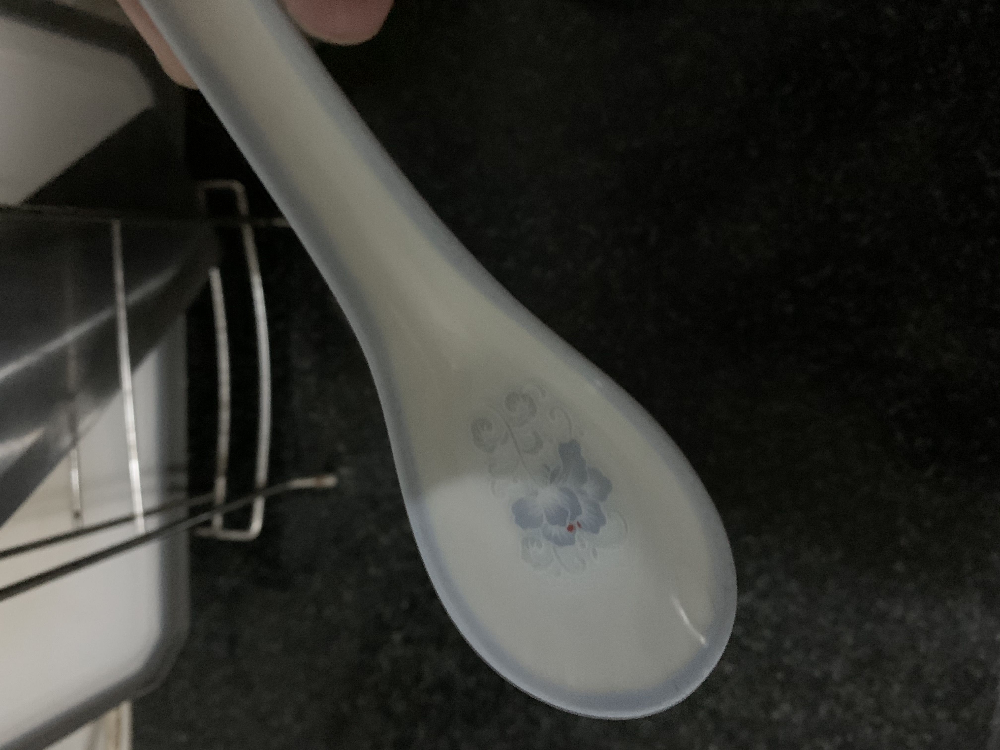

## 食材
* 中排,切成2-3cm大小(一般3人份的话1斤半差不多了)
* 葱
* 姜
* 料酒
* 黑醋/红醋
* 白芝麻
* 白砂糖/冰糖

## 步骤
1.排骨放入冷水静置20分钟，去除血水杂质

2.焯水
  - 排骨下锅倒入葱姜料酒焯水
  - 水沸腾之后就可以起锅清洗排骨,之前放入的葱姜全部丢掉,并且沥干排骨水分

3.炒糖色
  - 加入两大勺白砂糖,这次加入的糖比较多需要更好的控制火候,要一直保持小火,并隔几秒钟就需要搅拌,因为边缘的糖沸腾起泡后中间的糖可能还没完全化开,大约等到1/3的糖都开始沸腾之后立马将排骨倒入并加入两汤匙的冷水(防止后续翻炒时糖变焦)
  - 调至大火开始翻炒,3分钟左右即可

4.煮排骨
  - 加入冷水至刚好淹没排骨
  - 加盐一勺(因为主要是吃酸甜味,盐放少点也没关系)
  - 开大火将水煮沸后转小火煮30分钟(建议期间观察水量,搅拌下防止粘锅)

5.收汁
  - 转至大火收汁
  - 当汤汁变粘稠时倒入醋翻炒至有醋香即可(量大概是绕着排骨周围撒上两圈)

6.装盘撒上白芝麻,done!

## tips
1.最重要的一点,糖和醋一定要大胆的放,酸甜味重了可以用水涮涮,淡了那就神仙难救了

2.本方案中使用的勺子

## todo
尝试红醋 + 冰糖的优化版本
